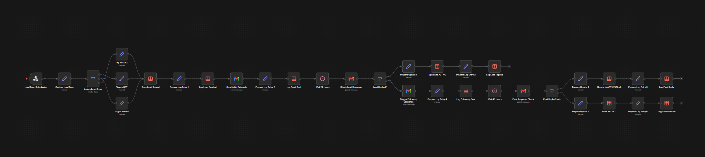

LeadFlow — Automated Lead Handling System

A simple system that makes sure no lead gets ignored, delayed, or forgotten.

---

Overview

Most businesses don’t lose leads because of bad offers.
They lose them because no one follows up on time.

This workflow fixes that.

From the moment someone fills a form → everything happens automatically.
No manual replies. No missed follow-ups.

---

What it does

* Captures leads instantly when a form is submitted
* Understands lead quality (HOT / WARM / COLD)
* Stores all lead data in one place
* Sends a personalized email within seconds
* Checks if the lead replied after 24 hours
* Sends a follow-up if there’s no response
* Updates lead status automatically (ACTIVE / COLD)
* Keeps a log of everything that happens

---

Workflow Preview

---

How it works

1. Someone fills out a form
2. The system captures and organizes their data
3. It decides how valuable the lead is
4. A personalized email is sent instantly
5. The system waits and watches for a reply
6. If there’s no response, it follows up automatically
7. The lead is updated based on their behavior

---

Project Structure

* `/workflow/leadflow-n8n.json` → Import this directly into n8n
* `/templates/` → Email messages used in the workflow
* `/assets/` → Workflow preview image

---

How to use

* Import the workflow into n8n
* Connect your email account (Gmail/SMTP)
* Connect your form to the webhook
* Turn it on and let it run

---

About

I build simple systems that help B2C businesses save time
by automating the work they shouldn’t be doing manually.
